# DataPrepper 使い方ガイド

このガイドでは、DataPrepperの使い方を手順に沿って説明します。

---

## 目次

1. [事前準備](#1-事前準備)
2. [DB接続設定](#2-db接続設定)
3. [テーブル入力シートの作成](#3-テーブル入力シートの作成)
4. [テストデータの入力](#4-テストデータの入力)
5. [SQL文のプレビュー（任意）](#5-sql文のプレビュー任意)
6. [SQLファイルの作成](#6-sqlファイルの作成)
7. [出力ファイルの確認](#7-出力ファイルの確認)
8. [バックアップの取得（任意）](#8-バックアップの取得任意)
9. [データベースへの登録](#9-データベースへの登録)

---

## 1. 事前準備

### 1.1 MySQL CLI の確認

ツールを使用する前に、MySQLコマンドラインツールが正しくインストールされているか確認します。

1. **操作シート**を開きます
2. 「**MySQL CLIの確認**」ボタンをクリックします

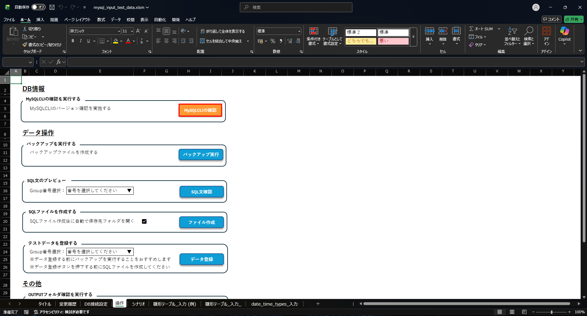

3. 正常にインストールされている場合、バージョン情報が表示されます

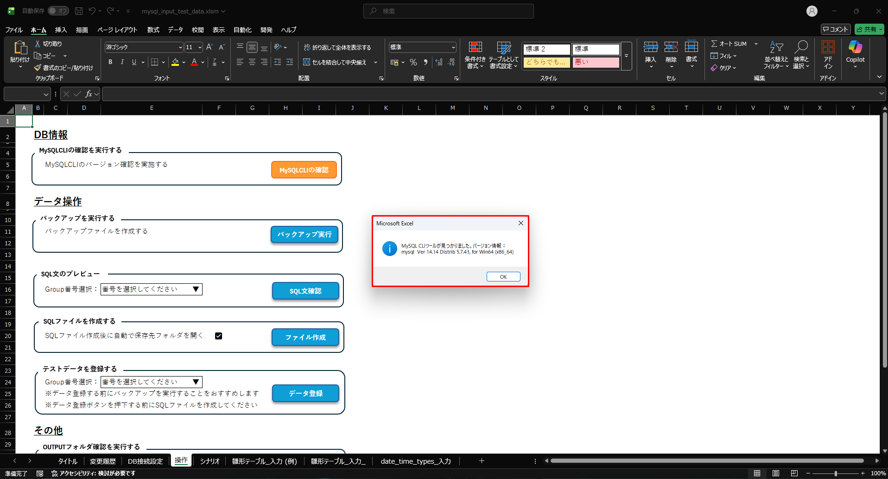

> ⚠️ **エラーが表示される場合**
> - MySQL がインストールされているか確認してください
> - 環境変数 PATHにMySQLのbinフォルダが追加されているか確認してください

---

## 2. DB接続設定

データベースへの接続情報を設定します。

1. 「**DB接続設定**」シートを開きます

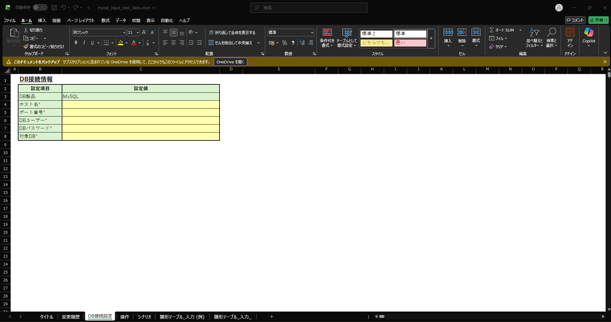

2. 以下の項目を入力します

| セル | 項目 | 入力例 |
|------|------|--------|
| C4 | ホスト名 | localhost |
| C5 | ポート番号 | 3306 |
| C6 | DBユーザー | root |
| C7 | DBパスワード | password123 |
| C8 | 対象DB | test_database |

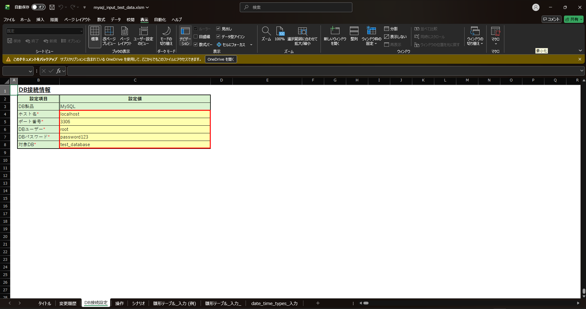

> 💡 **ポイント**: 未入力の項目がある場合、セルが赤くハイライトされエラーメッセージが表示されます。

---

## 3. テーブル入力シートの作成

テストデータを入力するシートを作成します。

### 3.1 雛形シートのコピー

1. 「**雛形テーブル_入力_**」シートを右クリックします
2. 「**移動またはコピー**」を選択します
3. 「**コピーを作成する**」にチェックを入れて「OK」をクリックします

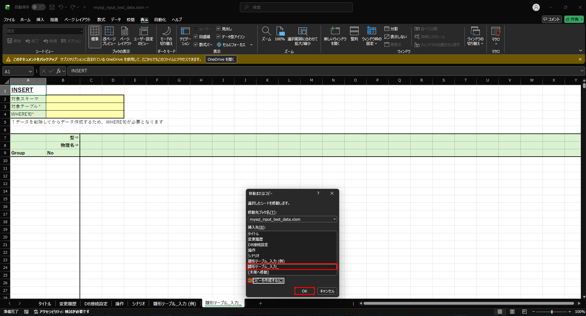

### 3.2 シート名の変更

1. コピーしたシートのタブをダブルクリックします
2. 「**テーブル名_入力**」の形式でシート名を変更します
   - 例: `users_入力`、`orders_入力`、`products_入力`


> ⚠️ **重要**: シート名は必ず「**_入力**」で終わる必要があります。この命名規則でツールがテーブル入力シートを認識します。

---

## 4. テストデータの入力

### 4.1 テーブル情報の設定

シート上部でテーブルの基本情報を設定します。

| セル | 項目 | 説明 | 必須 |
|------|------|------|:----:|
| B2 | スキーマ名 | データベーススキーマ名（省略可） | - |
| B3 | テーブル名 | 対象テーブル名 | ✓ |
| B4 | WHERE句 | DELETE文の条件 | ✓ |


**WHERE句の例**:
- `id > 0`（全件削除）
- `created_at >= '2024-01-01'`（特定条件で削除）
- `test_flag = 1`（テストデータのみ削除）

### 4.2 カラム情報の入力

**7～9行目**に各カラム情報を入力します。

| 行 | 項目 | 説明 | 必須 |
|----|------|------|:----:|
| 7行 | 型 | テーブルの型 | - |
| 8行 | 物理名 | テーブルの物理名 | - |
| 9行 | カラム名 | テーブルのカラム名 | ✓ |

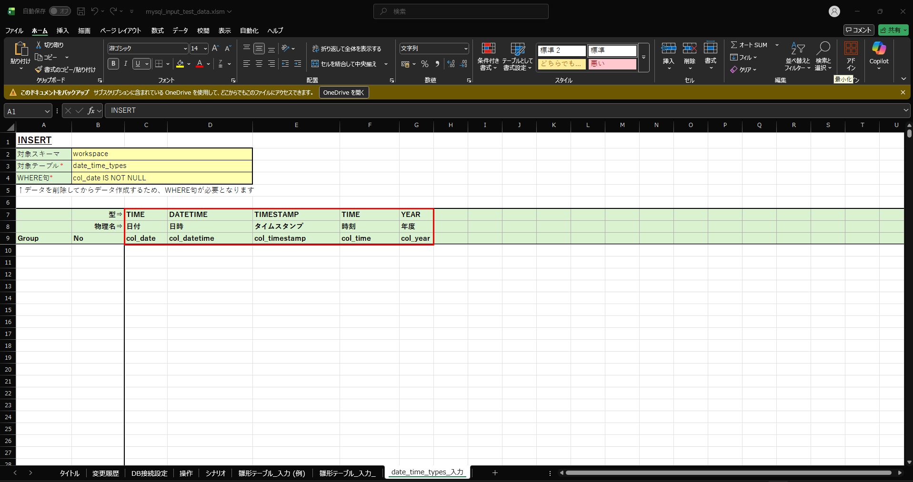

### 4.3 データの入力

**10行目以降**にテストデータを入力します。

| 列 | 項目 | 説明 |
|----|------|------|
| A列 | Group | SQLファイルの分割単位（1から自動連番） |
| B列 | No | 各グループ内の行番号（1から自動連番） |
| C列以降 | データ | 各カラムの値 |


> [!NOTE]
> テストデータ間で1行以上空けることで、次のテストケースが作成されます。

> ⚠️ **注意**: テストデータの件数が多すぎると、システムが正常に動作しない可能性があります。

### 4.4 Group と No のルール
```
Group | No | → 出力ファイル
------|----|---------------
  1   | 1  | input1_テーブル名.sql（DELETE + INSERT）
  1   | 2  |                      （INSERT追加）
  1   | 3  |                      （INSERT追加）
      |    |
  2   | 1  | input2_テーブル名.sql（DELETE + INSERT）
  2   | 2  |                      （INSERT追加）
```


### 4.5 NULL値の入力

NULL を登録したい場合は、以下のいずれかを入力します：

- `NULL`
- `null`
- `« NULL »`

---

## 5. SQL文のプレビュー（任意）

1. 「**操作**」シートを開きます
2. プルダウンからSQL文を確認する **Group 番号**を選択します

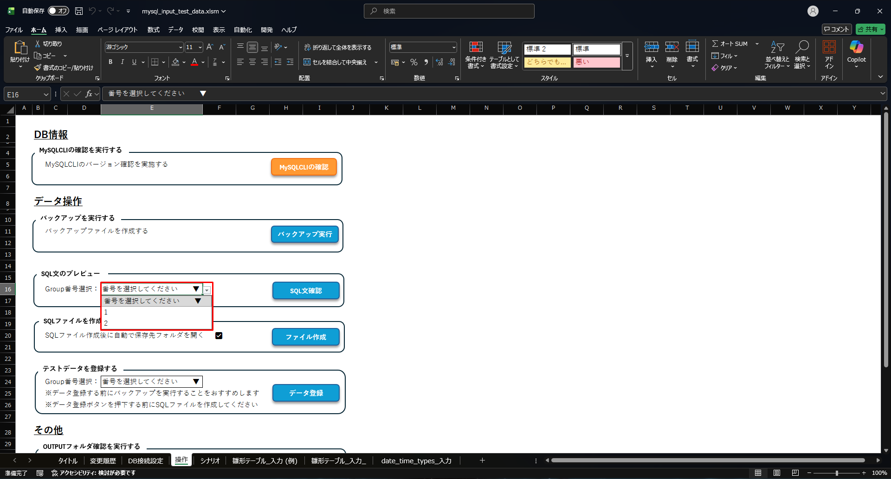

3. 「**SQL文確認**」ボタンをクリックします

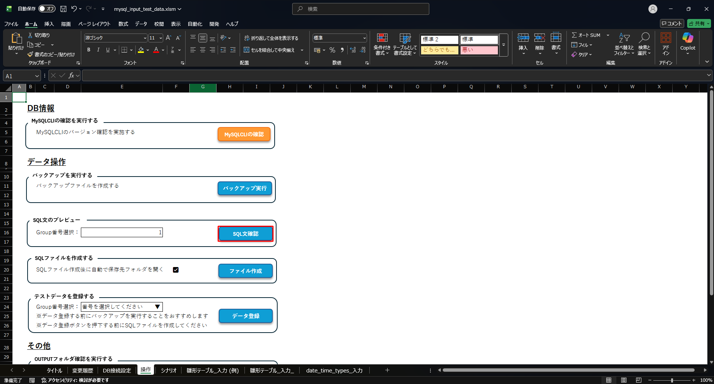

4. 新しいブックが開き、生成されるSQL文がプレビュー表示されます

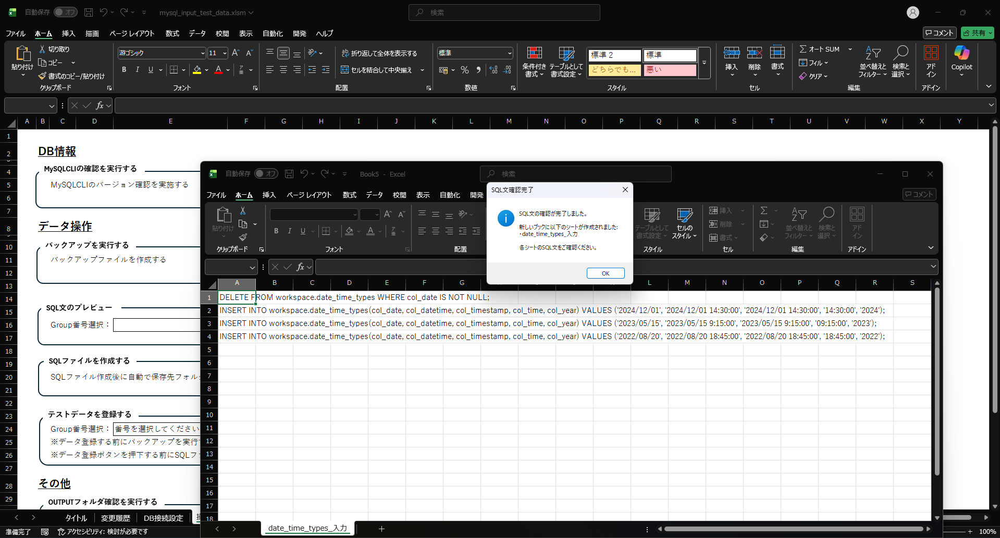

---

## 6. SQLファイルの作成

入力したデータからSQLファイルを生成します。

1. 「**操作**」シートを開きます
2. 「**ファイル作成**」ボタンをクリックします

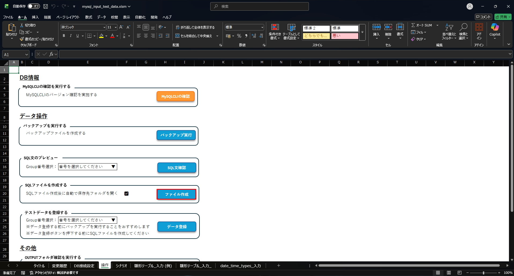

3. 処理が完了すると、完了メッセージが表示されます

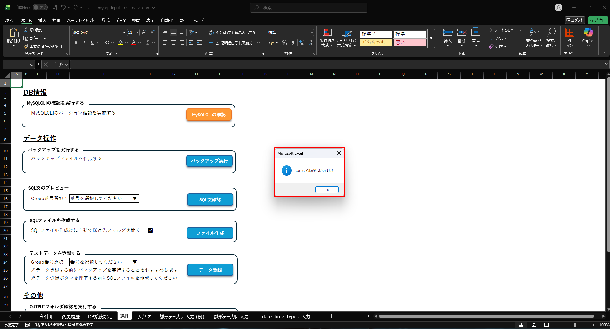

4. 「**自動でフォルダを開く**」にチェックが入っている場合、output フォルダが自動で開きます

### 出力されるファイル
```
./output/
├── input1_users.sql      ← Group 1 のSQLファイル
├── input2_users.sql      ← Group 2 のSQLファイル
├── input1_orders.sql     ← 別テーブルのGroup 1
└── ...
```

---

## 7. 出力ファイルの確認

出力したSQLファイルの内容を確認できます。

### 7.1 ファイル一覧の確認

1. 「**操作**」シートで「**OUTPUTフォルダ確認**」ボタンをクリックします

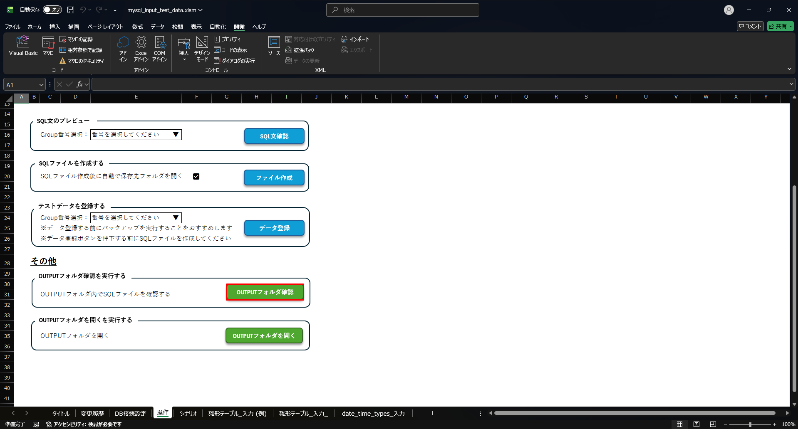

2. output フォルダ内のSQLファイル一覧が表示されます

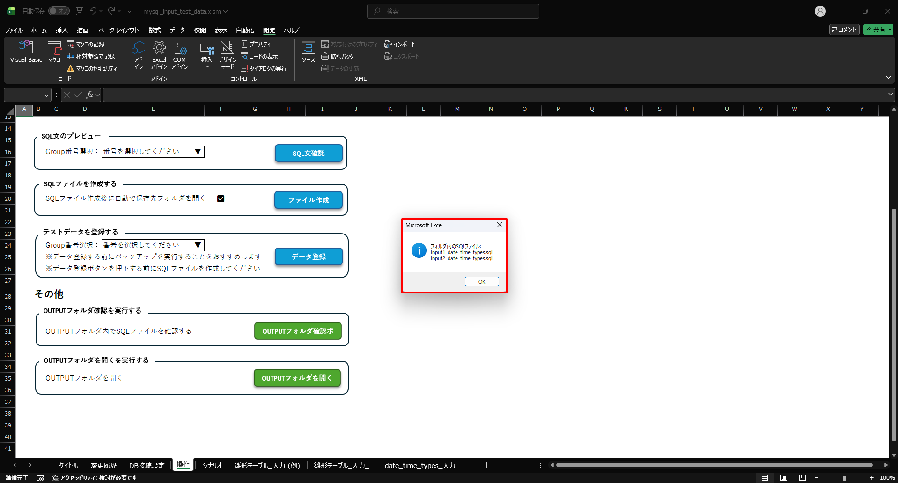

### 7.2 出力フォルダを開く

1. 「**操作**」シートで「**OUTPUTフォルダを開く**」ボタンをクリックします

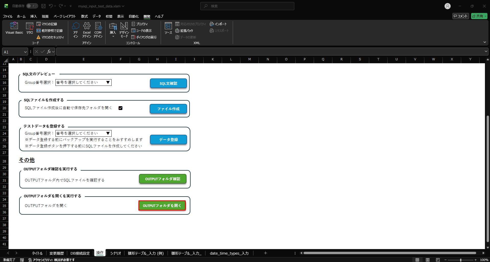

2. OUTPUTフォルダが表示されます

---

## 8. バックアップの取得（任意）

データ登録前にバックアップを取得しておくと、問題発生時に復旧できます。

1. 「**操作**」シートを開きます
2. 「**バックアップ実行**」ボタンをクリックします

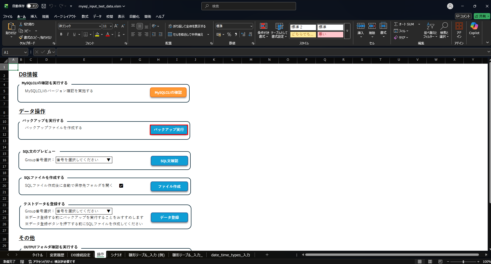

3. 処理が完了すると、実行メッセージが表示されます

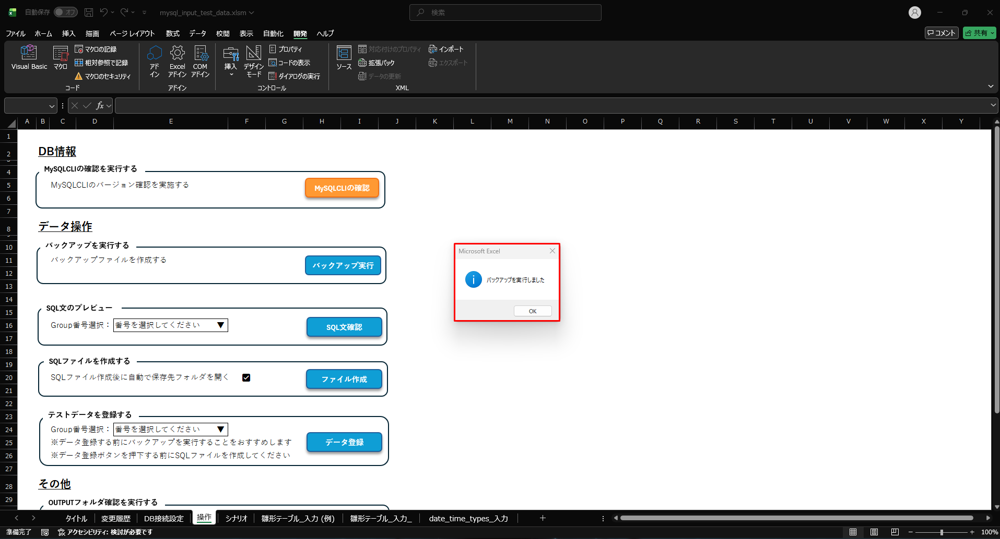

### バックアップファイルの保存場所
```
./output/backup/
└── backup_20241224.sql    ← YYYYMMDD形式の日付
```

> 💡 **ポイント**: バックアップは `mysqldump` コマンドで取得されます。同日に複数回実行すると上書きされます。

---

## 9. データベースへの登録

生成したSQLをデータベースに実行します。

### 9.1 操作シートからの実行

1. 「**操作**」シートを開きます
2. プルダウンから登録する **Group 番号**を選択します

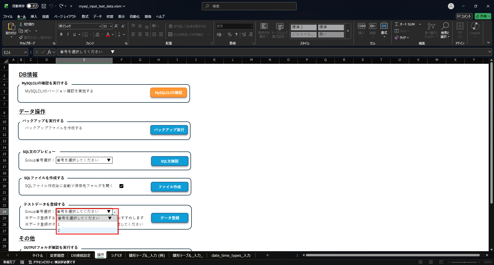

3. 「**データ登録**」ボタンをクリックします

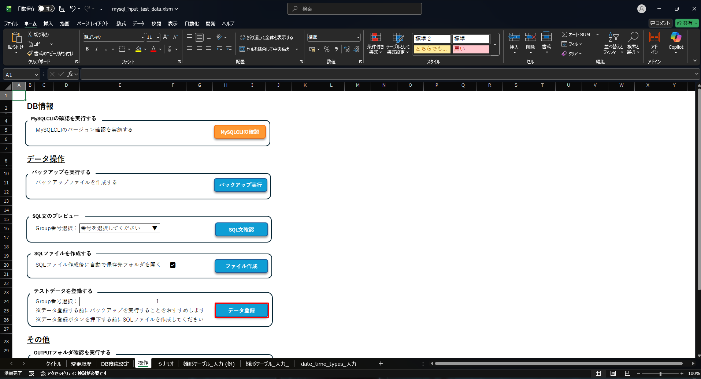

4. バックアップファイルが存在しない場合、確認ダイアログが表示されます

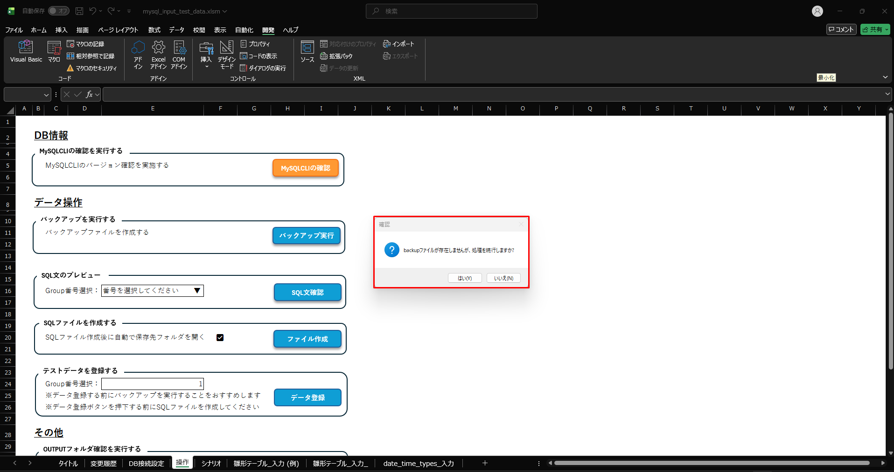

5. 処理が完了すると、結果メッセージが表示されます

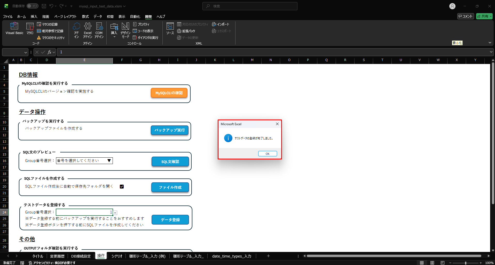
