# DataPrepper for PostgreSQL 使い方ガイド

このガイドでは、DataPrepper for PostgreSQLの使い方を手順に沿って説明します。

---

## 目次

1. [事前準備](#1-事前準備)
2. [DB接続設定](#2-db接続設定)
3. [テーブル入力シートの作成](#3-テーブル入力シートの作成)
4. [テストデータの入力](#4-テストデータの入力)
5. [SQL文のプレビュー（任意）](#5-sql文のプレビュー任意)
6. [SQLファイルの作成](#6-sqlファイルの作成)
7. [出力ファイルの確認](#7-出力ファイルの確認)
8. [バックアップの取得（任意）](#8-バックアップの取得任意)
9. [データベースへの登録](#9-データベースへの登録)
10. [実行ステータスの確認](#10-実行ステータスの確認)

---

## 1. 事前準備

### 1.1 PostgreSQL CLI のバージョン確認

ツールを使用する前に、PostgreSQLコマンドラインツール（psql）が正しくインストールされているか確認します。

1. **操作シート**を開きます
2. 「**バージョン確認**」ボタンをクリックします

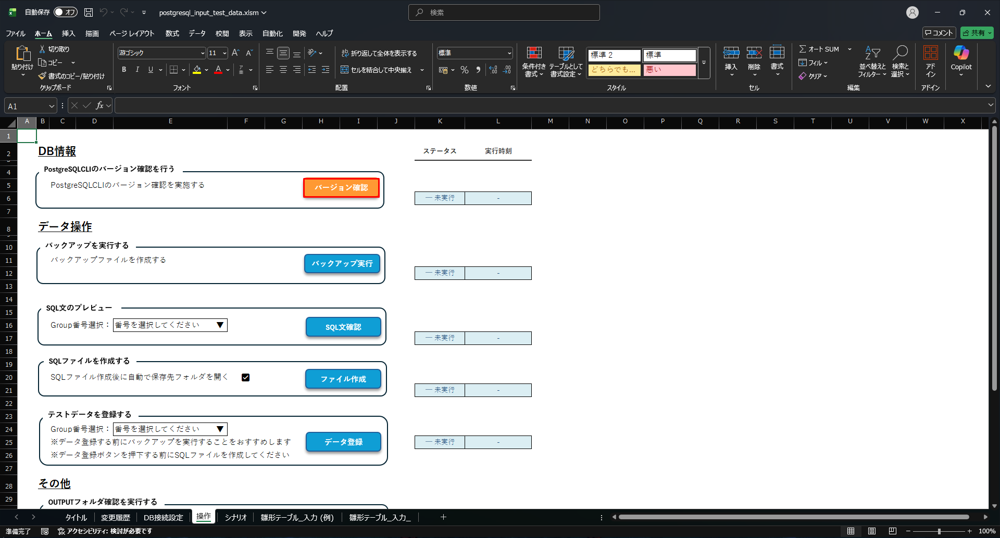

3. 正常にインストールされている場合、バージョン情報が表示されます

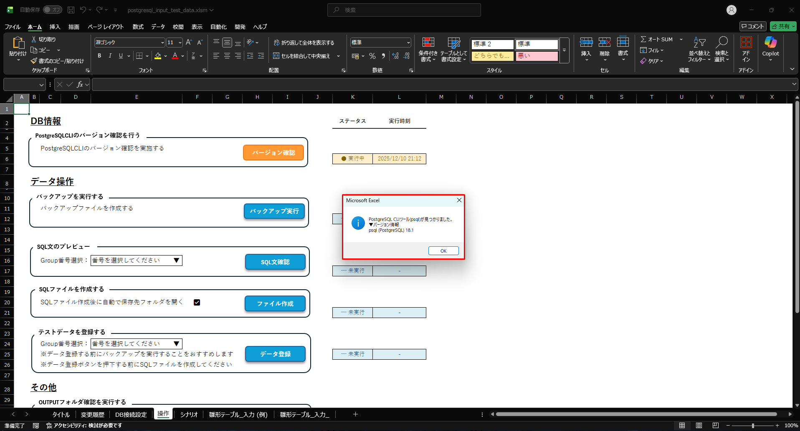

> ⚠️ **エラーが表示される場合**
> - PostgreSQL がインストールされているか確認してください
> - 環境変数 PATHにPostgreSQLのbinフォルダが追加されているか確認してください

---

## 2. DB接続設定

データベースへの接続情報を設定します。

1. 「**DB接続設定**」シートを開きます

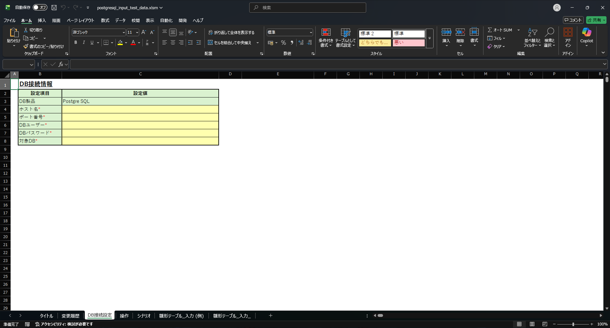

2. 以下の項目を入力します

| セル | 項目 | 入力例 |
|------|------|--------|
| C4 | ホスト名 | localhost |
| C5 | ポート番号 | 5432 |
| C6 | DBユーザー | postgres |
| C7 | DBパスワード | password123 |
| C8 | 対象DB | test_database |

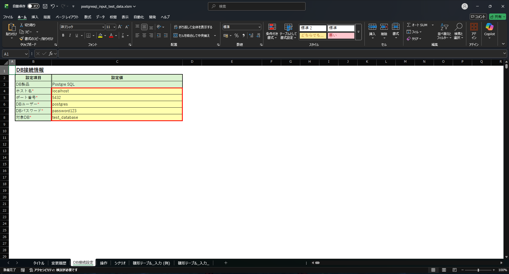

> 💡 **ポイント**: 未入力の項目がある場合、セルが赤くハイライトされ、D列にエラーメッセージが赤文字で表示されます。

> ⚠️ **注意**: シートを開くたびにD列のエラーメッセージはクリアされ、入力セル（C4〜C8）の背景色は黄色にリセットされます。

---

## 3. テーブル入力シートの作成

テストデータを入力するシートを作成します。

### 3.1 雛形シートのコピー

1. 「**雛形テーブル_入力_**」シートを右クリックします
2. 「**移動またはコピー**」を選択します
3. 「**コピーを作成する**」にチェックを入れて「OK」をクリックします

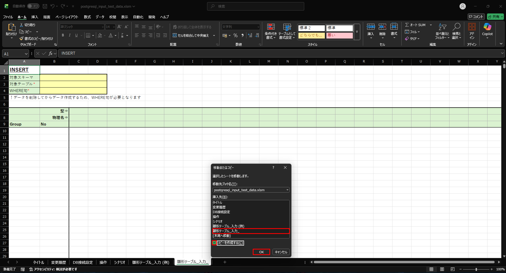

### 3.2 シート名の変更

1. コピーしたシートのタブをダブルクリックします
2. 「**テーブル名_入力**」の形式でシート名を変更します
   - 例: `users_入力`、`orders_入力`、`products_入力`

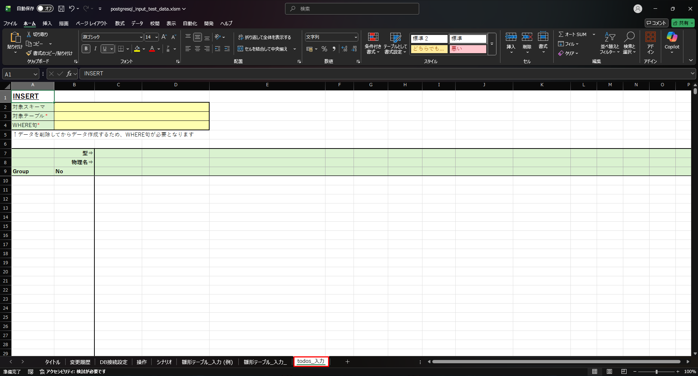

> ⚠️ **重要**: シート名は必ず「**_入力**」で終わる必要があります。この命名規則でツールがテーブル入力シートを認識します。

---

## 4. テストデータの入力

### 4.1 テーブル情報の設定

シート上部でテーブルの基本情報を設定します。

| セル | 項目 | 説明 | 必須 |
|------|------|------|:----:|
| B2 | スキーマ名 | データベーススキーマ名（省略可） | - |
| B3 | テーブル名 | 対象テーブル名 | ✓ |
| B4 | WHERE句 | DELETE文の条件 | ✓ |

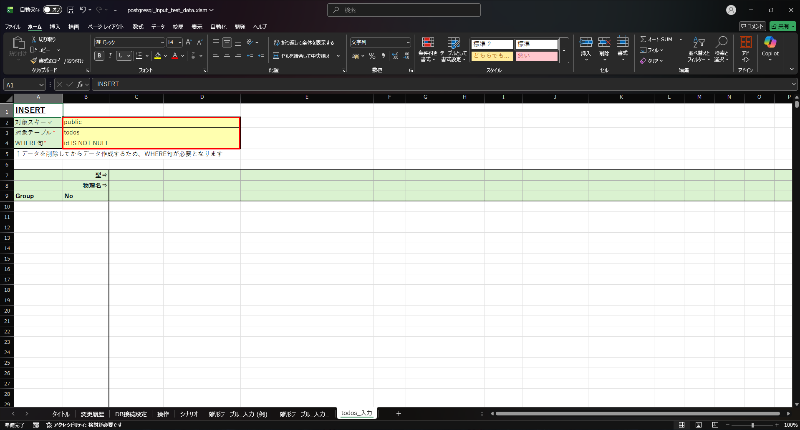

**WHERE句の例**:
- `id > 0`（全件削除）
- `created_at >= '2024-01-01'`（特定条件で削除）
- `test_flag = true`（テストデータのみ削除）

### 4.2 カラム情報の入力

**7～9行目**に各カラム情報を入力します。

| 行 | 項目 | 説明 | 必須 |
|----|------|------|:----:|
| 7行 | 型 | テーブルの型 | - |
| 8行 | 物理名 | テーブルの物理名 | - |
| 9行 | カラム名 | テーブルのカラム名 | ✓ |

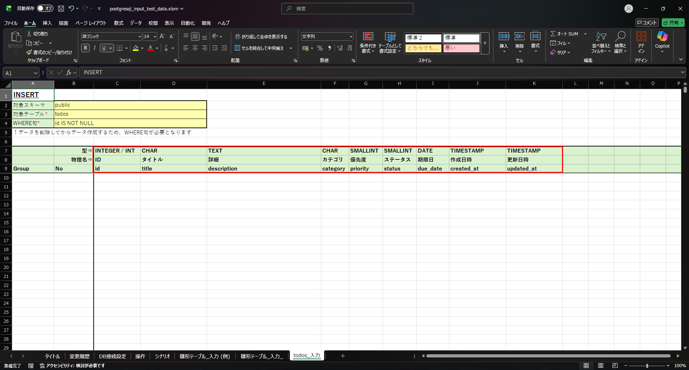

> ⚠️ **注意**: カラム名（9行目）に空欄があるとエラーになります。使用するカラムは連続して入力してください。

### 4.3 データの入力

**10行目以降**にテストデータを入力します。

| 列 | 項目 | 説明 |
|----|------|------|
| A列 | Group | SQLファイルの分割単位（1から自動連番） |
| B列 | No | 各グループ内の行番号（1から自動連番） |
| C列以降 | データ | 各カラムの値 |

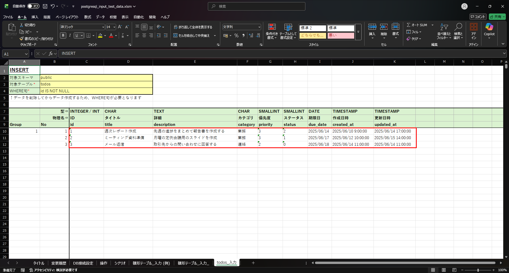

> [!NOTE]
> テストデータ間で1行以上空けることで、次のテストケースが作成されます。

> ⚠️ **注意**: テストデータの件数が多すぎると、システムが正常に動作しない可能性があります。

> ⚠️ **注意**: データ行が全て空欄の場合、エラーが発生します。各行には少なくとも1つ以上の値を入力してください。

### 4.4 Group と No のルール

- **A10セル（最初のGroup）は必ず「1」から開始**してください
- **B10セル（最初のNo）は必ず「1」から開始**してください

```
Group | No | → 出力フォルダ/ファイル
------|----|---------------------------
  1   | 1  | group1/input1_{シート順序}_テーブル名.sql（DELETE + INSERT）
  1   | 2  |                                          （INSERT追加）
  1   | 3  |                                          （INSERT追加）
      |    |
  2   | 1  | group2/input2_{シート順序}_テーブル名.sql（DELETE + INSERT）
  2   | 2  |                                          （INSERT追加）
```

> 💡 **ポイント**:
> - Group番号ごとにフォルダが分かれます（group1, group2, ...）
> - シート順序は「_入力」で終わるシートの並び順（左から1, 2, 3...）で決まります
> - これにより、複数テーブル間の登録順序を制御できます

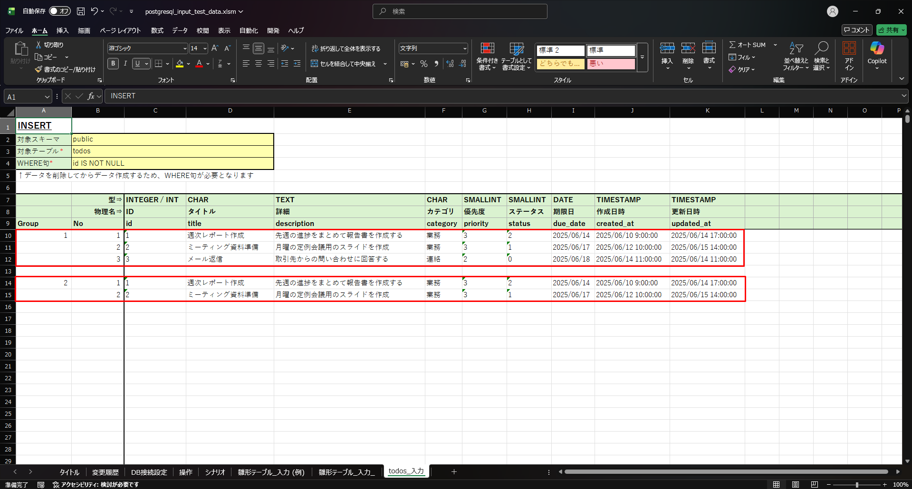

### 4.5 NULL値の入力

NULL を登録したい場合は、以下のいずれかを入力します：

- `NULL`
- `null`
- `« NULL »`

---

## 5. SQL文のプレビュー（任意）

1. 「**操作**」シートを開きます
2. プルダウンからSQL文を確認する **Group 番号**を選択します

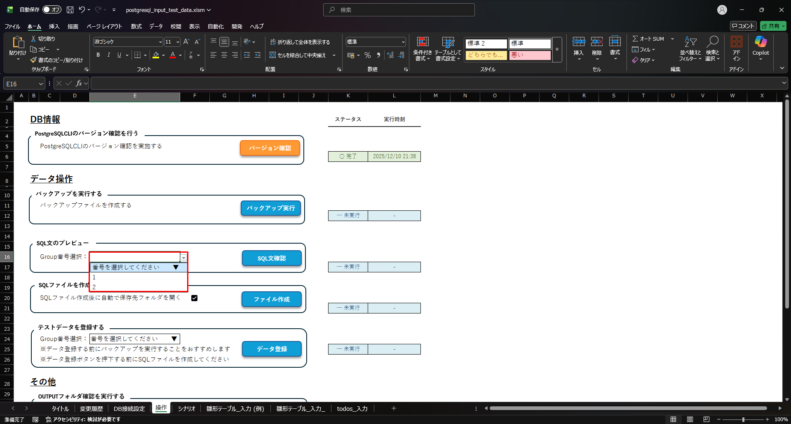

3. 「**SQL文確認**」ボタンをクリックします

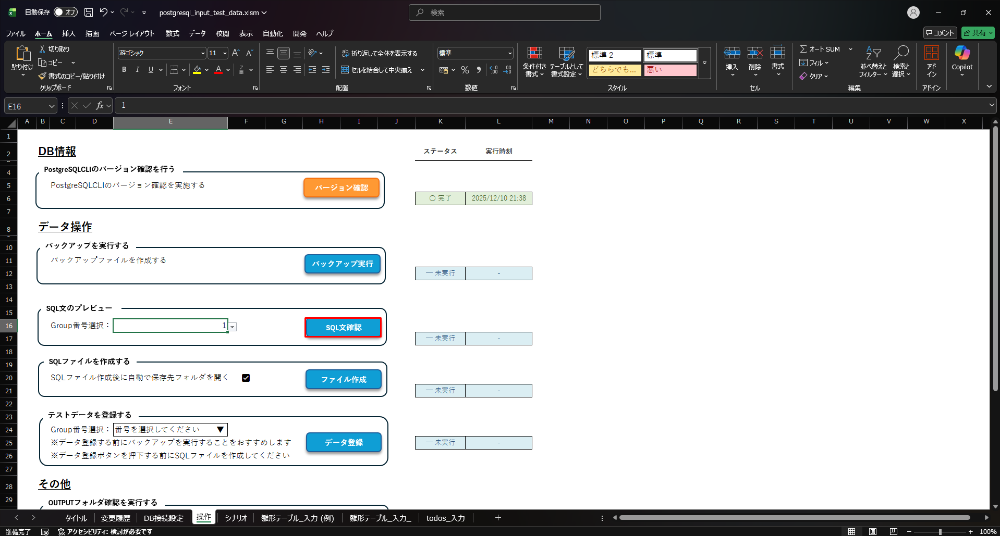

4. 新しいブックが開き、生成されるSQL文がプレビュー表示されます

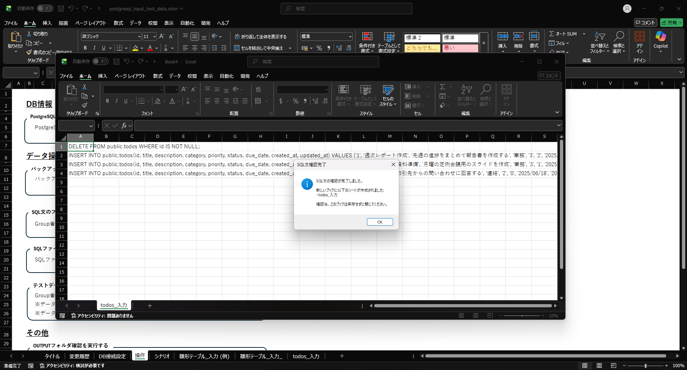

> 💡 **ポイント**: 指定したGroup番号のテストデータがない場合、エラーメッセージが表示されます。

---

## 6. SQLファイルの作成

入力したデータからSQLファイルを生成します。

1. 「**操作**」シートを開きます
2. 「**ファイル作成**」ボタンをクリックします

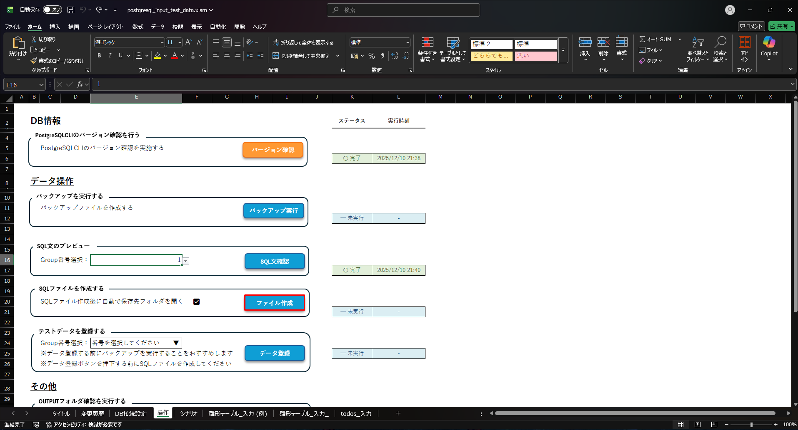

3. 処理が完了すると、完了メッセージが表示されます

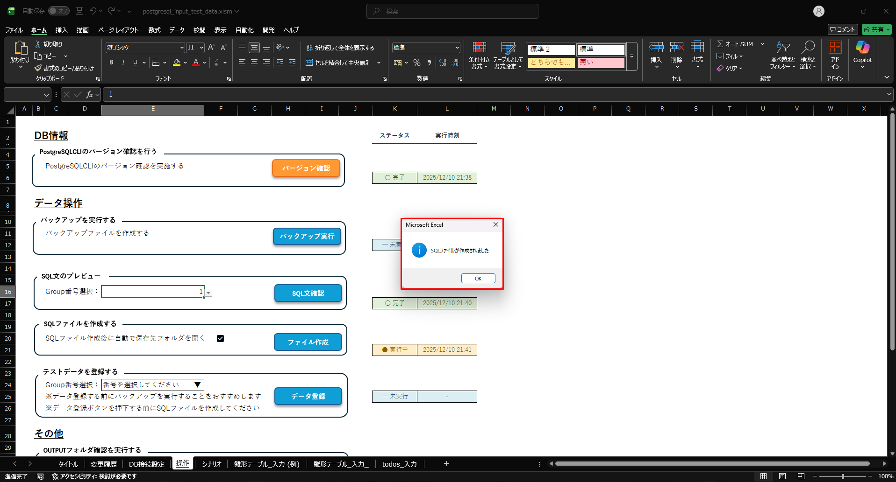

4. 「**自動でフォルダを開く**」にチェックが入っている場合、output フォルダが自動で開きます

### 出力されるファイル
```
./output/
├── group1/                     ← Group 1 のフォルダ
│   ├── input1_1_users.sql      ← Group 1, シート順序 1 のSQLファイル
│   └── input1_2_orders.sql     ← Group 1, シート順序 2 のSQLファイル
├── group2/                     ← Group 2 のフォルダ
│   ├── input2_1_users.sql      ← Group 2, シート順序 1 のSQLファイル
│   └── input2_2_orders.sql     ← Group 2, シート順序 2 のSQLファイル
└── ...
```

> 💡 **フォルダ構成**: `output/group{GroupNo}/`
> - Group番号ごとにフォルダが作成されます
> - データ登録時は選択したGroupフォルダ内のファイルのみが実行されます

> 💡 **ファイル名形式**: `input{GroupNo}_{SheetOrder}_テーブル名.sql`
> - データ登録時はシート順序（SheetOrder）の昇順で実行されるため、外部キー制約のある親テーブルを先（シート順序が小さい方）に配置してください。

---

## 7. 出力ファイルの確認

出力したSQLファイルの内容を確認できます。

### 7.1 ファイル一覧の確認

1. 「**操作**」シートで「**OUTPUTフォルダ確認**」ボタンをクリックします

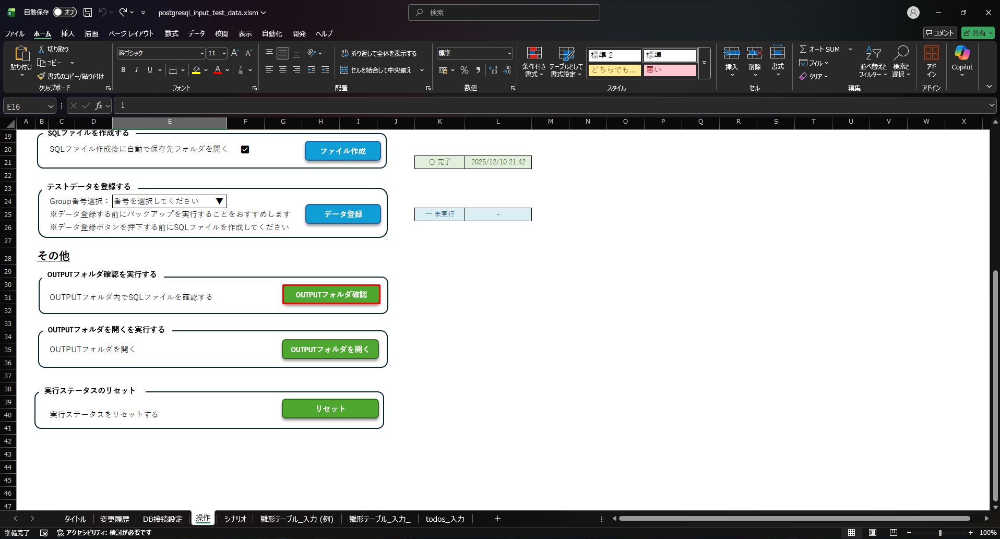

2. output フォルダ内のGroupフォルダとSQLファイル一覧が表示されます

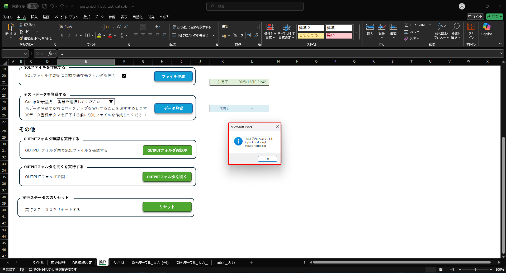

> 💡 **ポイント**: Groupフォルダごとにファイル一覧が表示されます（各フォルダ最大10件まで表示）

### 7.2 出力フォルダを開く

1. 「**操作**」シートで「**OUTPUTフォルダを開く**」ボタンをクリックします

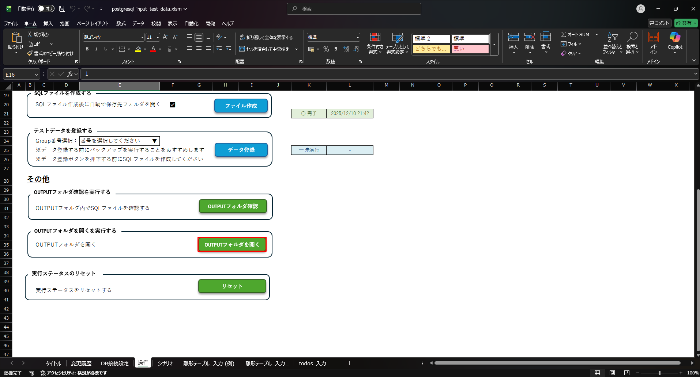

2. OUTPUTフォルダが表示されます

---

## 8. バックアップの取得（任意）

データ登録前にバックアップを取得しておくと、問題発生時に復旧できます。

1. 「**操作**」シートを開きます
2. 「**バックアップ実行**」ボタンをクリックします

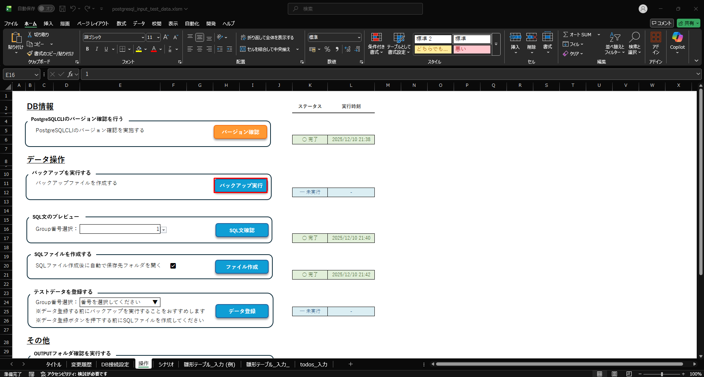

3. 処理が完了すると、実行メッセージが表示されます

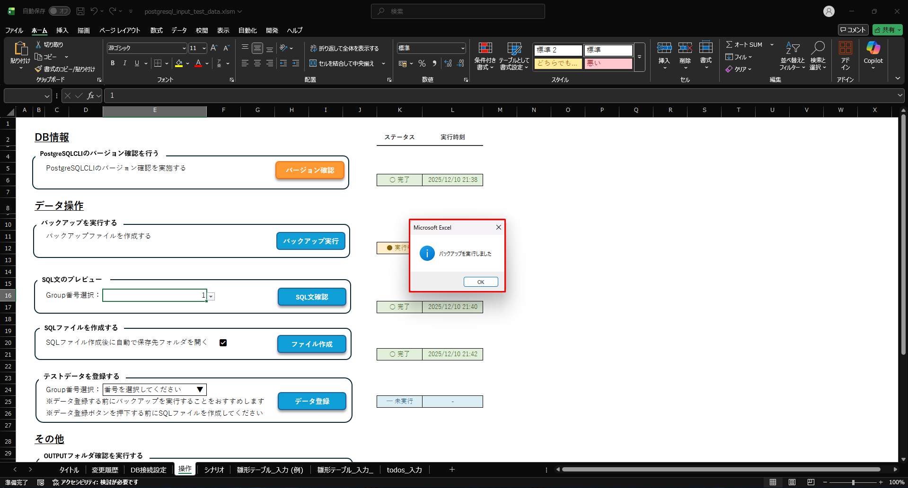

### バックアップファイルの保存場所
```
./output/backup/
└── backup_20241224.sql    ← YYYYMMDD形式の日付
```

> 💡 **ポイント**: バックアップは `pg_dump` コマンドで取得されます。同日に複数回実行すると上書きされます。

> ⚠️ **注意**: バックアップファイルが空の場合、DB接続設定を確認してください。

---

## 9. データベースへの登録

生成したSQLをデータベースに実行します。

### 9.1 操作シートからの実行

1. 「**操作**」シートを開きます
2. プルダウンから登録する **Group 番号**を選択します

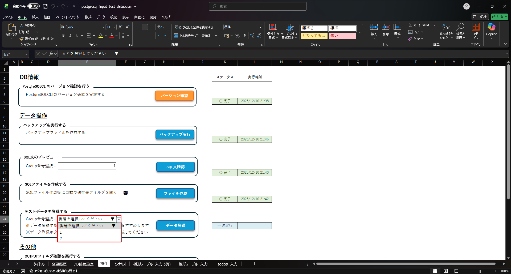

3. 「**データ登録**」ボタンをクリックします

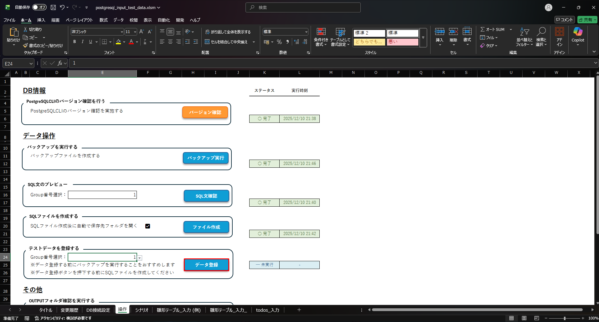

4. バックアップファイルが存在しない場合、確認ダイアログが表示されます

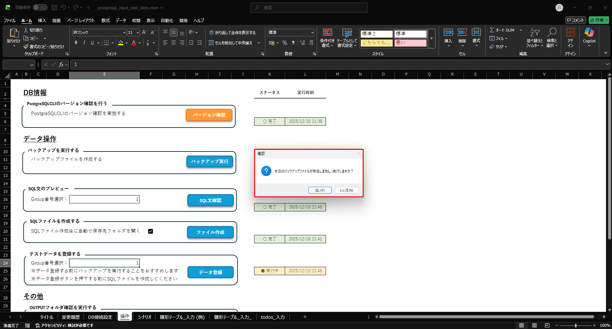

5. 処理が完了すると、結果メッセージが表示されます

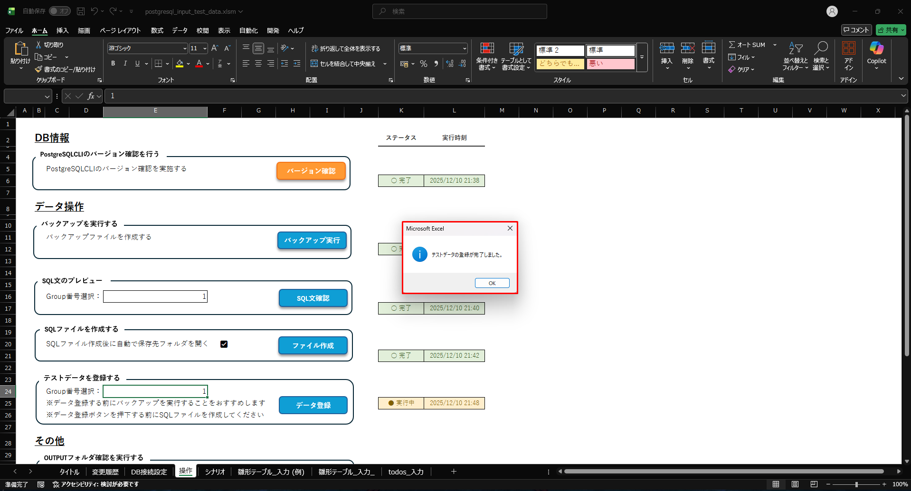

> 💡 **ポイント**: 選択したGroup番号に対応するフォルダ（`output/group{番号}/`）内のSQLファイルが順番に実行されます。

> ⚠️ **注意**: エラーが発生した場合は `./output/psql_log.txt` でログを確認してください。

---

## 10. 実行ステータスの確認

各操作の実行状態を視覚的に確認できます。

### 10.1 ステータス表示エリア

「**操作**」シートの右側（K列・L列）に、各機能の実行ステータスと実行時刻が表示されます。

| ステータス | 表示 | 説明 |
|-----------|------|------|
| 未実行 | ─ 未実行 | まだ実行されていない状態（薄い青色） |
| 実行中 | ● 実行中 | 処理を実行している状態（薄い黄色） |
| 完了 | ○ 完了 | 正常に完了した状態（薄い緑色） |
| エラー | × エラー | エラーが発生した状態（薄いオレンジ色） |

### 10.2 対象機能

以下の機能の実行ステータスが表示されます：

1. **バージョン確認**（6行目）
2. **バックアップ実行**（12行目）
3. **SQL文確認**（17行目）
4. **ファイル作成**（21行目）
5. **データ登録**（25行目）

### 10.3 ステータスのリセット

全ての実行ステータスを「未実行」に戻したい場合：

1. 「**操作**」シートを開きます
2. 「**リセット**」ボタンをクリックします
3. 全てのステータスが「未実行」に戻り、実行時刻が「-」にリセットされます

> 💡 **ポイント**: 新しいテストを開始する前や、ステータス表示をクリアしたい場合に使用してください。

---

## よくあるエラーと対処法

### 「Group番号が選択されていません」
- **原因**: プルダウンでGroup番号を選択せずにボタンをクリックした
- **対処**: プルダウンから有効なGroup番号を選択してください

### 「Group番号に数値を入力してください」
- **原因**: プルダウンに無効な値が入力されている
- **対処**: プルダウンから正しい数値を選択し直してください

### 「group○フォルダが存在しません」
- **原因**: データ登録時に対象のGroupフォルダが見つからない
- **対処**: 先に「ファイル作成」を実行してGroupフォルダとSQLファイルを生成してください

### 「○○シートの対象テーブルが入力されていません」
- **原因**: テーブル入力シートのB3セル（テーブル名）が空
- **対処**: 対象テーブル名を入力してください

### 「○○シートのWHERE句が指定されていません」
- **原因**: テーブル入力シートのB4セル（WHERE句）が空
- **対処**: DELETE文の条件となるWHERE句を入力してください

### 「○○シートに空欄のカラムがあります」
- **原因**: 9行目のカラム名に空欄が含まれている
- **対処**: カラム名を連続して入力するか、不要な列を削除してください

### 「○○シートのGroup列(A10セル)は1から入力してください」
- **原因**: テストデータの開始位置が正しくない
- **対処**: A10セルに「1」を入力してください

### 「○○シートのNo列(B10セル)は1から入力してください」
- **原因**: テストデータのNo列の開始位置が正しくない
- **対処**: B10セルに「1」を入力してください

### 「○○シートのデータに未入力の行があります。△行目をご確認ください」
- **原因**: 指定された行のデータが全て空欄
- **対処**: 該当行にデータを入力するか、不要な場合は行を削除してください

### 「テストデータの登録に失敗しました」
- **原因**: SQLの実行中にエラーが発生
- **対処**: `./output/psql_log.txt` を確認し、SQL構文やデータ型のエラーを修正してください
